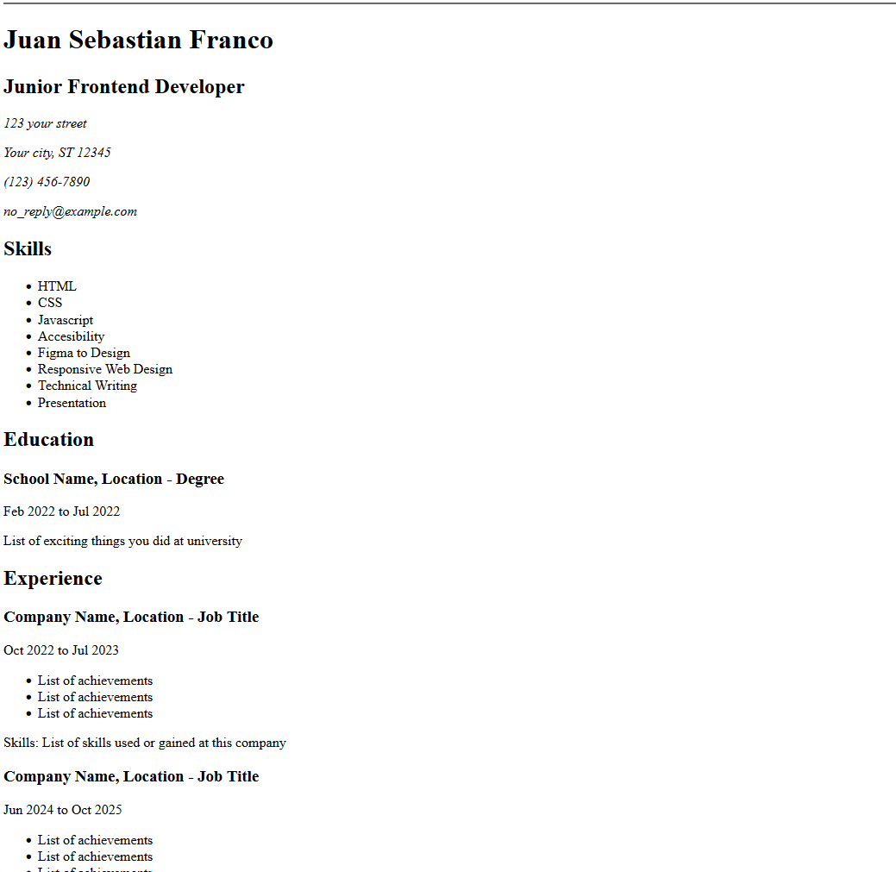

# 🚀 Quick Start Guide

Follow these simple steps to get the roadmap.sh-frontend running on your local machine:

## 📥 Installation

1. Clone this repository:
```bash
git clone https://github.com/Juanfranco-ui/roadmap.sh-frontend.git
cd roadmap.sh-frontend
```

2. Open the index.html to visualize in your browser:
```
index.html
```

## 📱 Preview



The project should now be running locally with hot reload enabled! 🎉
URL Link: [https://roadmap.sh/projects/testimonial-cards](https://roadmap.sh/projects/datepicker-ui)


